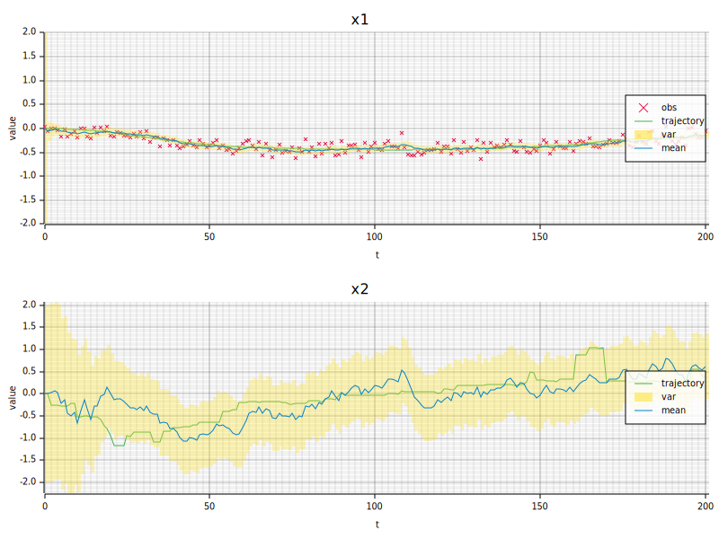
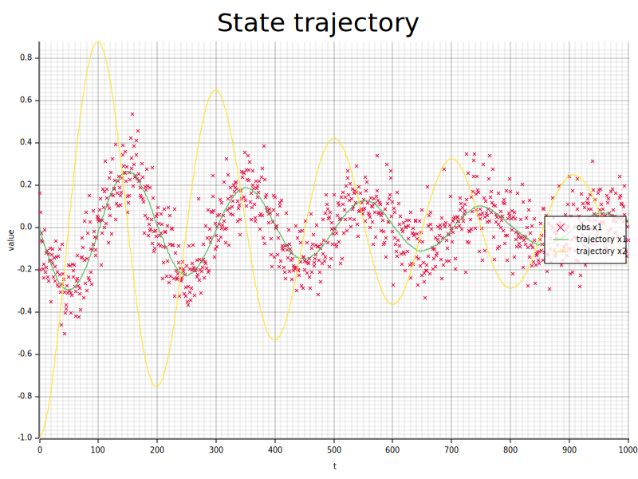

# ssm-rs

State Space Models in Rust.

## Overview

`ssm-rs` models stochastic, non-linear state-space systems in continuous time:

$$\begin{aligned}
d{X}_t &= f(X_t, U_t)dt + HdZ_t \\
Y_t &= g(X_t) + W_t
\end{aligned}$$
or their discrete time equivalent

$$\begin{aligned}
    {X}_{k+1} &= f(X_k, U_k) + HZ_k \\
    Y_k &= g(X_k) + W_k
\end{aligned}$$

The standard linear models are special cases of these systems

$$\begin{aligned}
f(X_t, U_t) &= A_tX_t+B_tU_t\\
g(X_t) &= C_tX_t
\end{aligned}$$

## Useful features (so far)
### A friendly api for defining models
Includes:
- Static checks on dimension. No silly bugs.
- Basic traits that allow for the definition of custom model components, for example: analytical Jacobians, new types of noise, new types of filter.

### Exact discretisation of deterministic continuous-time linear systems

`DiscreteLinearSystem::from_expm` converts a continuous-time linear system to discrete time. It uses a Padé approximation with scaling and squaring to solve the noiseless system exactly in the case of a zero-order hold.

$$\exp \Bigr(\begin{bmatrix}
 A & B \\
 0 & 0 \\
\end{bmatrix}t\Bigr) = \begin{bmatrix}
    e^{At} & \int_0^{t} e^{As}Bds \\ 0 & I
\end{bmatrix}$$
$$x_t = e^{At}x_0 + \int_0^{t} e^{As}Bds \cdot u$$

### Stochastic models
The stochastic integral process, $I_t = \int_0^{t} e^{As}dZs$, is generally more complicated. The model requires direct implementation of the integrated process via samples from the marginal distribution. Some basic cases are readily available:
1. Brownian motion -> Gaussian increments
2. Variance Gamma -> Gaussian mixture representation (not yet implemented)

### Simulation of linear & non-linear systems
Currently using the explicit RK4 method to forward simulate systems.

### Kalman filtering for linear Gaussian system
A numerically stable implementation of the Kalman filter

### Trajectory plots
Helpful functionality for plotting state trajectories and the results of filtering

## Useful features (upcoming)
### Non-Gaussian noise processes
- **Variance-gamma noise** — allows modelling of higher order moments
- **$\alpha$-stable noise** — very general noise model

### Non-linear and non-Gaussian filters
- **Extended Kalman filter (EKF)** — linearisation of system around current estimate, either analytically or with autodiff
- **Particle filter** — state filtering for non-linear / non-Gaussian system
- **Marginal particle filter** — Rao-Blackwellisation for better inference in conditionally Gaussian structures
- **Parameter estimation** - ML methods, EM methods, particle MCMC

### Smoothers
- **RTS smoother** — Rauch-Tung-Striebel smoother for linear systems

### Controllers
- **State feedback / LQR** — linear-quadratic regulator, PD, PID
- **Model predictive control (MPC)** — receding-horizon optimisation with constraints

## Examples

### Langevin
A basic example of a 1D langevin model with Brownian noise.
$$\begin{aligned}
    d\dot{X}_t &= \frac{\lambda}{m} \dot{X}_tdt + \frac{1}{m}dZ_t\\
    dX_t &= \dot{X}_tdt
\end{aligned}$$
```rust
use nalgebra::{matrix, vector, SMatrix};

use ssm_rs::types::Real;
use ssm_rs::controllers::{Controller, Nontroller};
use ssm_rs::dynamics::{
    ContinuousDynamics, ContinuousLinearSystem, DiscreteDynamics, DiscreteLinearSystem,
};
use ssm_rs::filters::{Filter, KalmanFilter, StateEstimate};
use ssm_rs::noise::{Noise, WhiteNoise};
use ssm_rs::plots::StatePlot;

fn main() {
    let m = 1.;
    let c = -1.;
    let continuous_dynamics = ContinuousLinearSystem::new(
        matrix![0., 1.; 0., c/m],
        matrix![0.; 0.],
        matrix![0.; 1./m],
        matrix![1., 0.],
    );
    let dt = 0.01;
    let dynamics = DiscreteLinearSystem::from_expm(&continuous_dynamics, dt);

    let controller = Nontroller;
    let sp = 1.;
    let so = 0.1;

    let process_noise = WhiteNoise::new(vector![0.], matrix![sp * sp * dt]);
    let observation_noise = WhiteNoise::new(vector![0.], matrix![so * so]);
    let mut rng = rand::rng();

    let mut x = vector![0., 0.];
    let mut trajectory = vec![x];
    let mut observations = vec![dynamics.observe(&x, &observation_noise.sample(&mut rng))];

    let filter = KalmanFilter::new(dynamics, matrix![sp * sp * dt], matrix![so * so]);
    let mut state = StateEstimate::new(x, SMatrix::<Real, 2, 2>::identity());
    let mut states = vec![state.clone()];

    let u = controller.control_law(&x);

    let n = (2. / dt) as usize;
    for _ in 0..n {
        x = continuous_dynamics.step_rk4(&x, &u, &process_noise.sample(&mut rng), dt);
        trajectory.push(x);
        state = filter.predict(&state, &u);
        let y = continuous_dynamics.observe(&x, &observation_noise.sample(&mut rng));
        observations.push(y);
        state = filter.update(&state, &y);
        states.push(state);
    }
    let means: Vec<_> = states.iter().map(|s| s.m().clone()).collect();
    let vars: Vec<_> = states.iter().map(|s| s.p().clone().diagonal()).collect();
    StatePlot::<2, 1>::new("langevin.svg")
        .add_markers("obs", &observations)
        .add_line("trajectory", &trajectory)
        .add_confidence_band("var", &means, &vars, 2.)
        .add_line("mean", &means)
        .draw()
        .unwrap();
}
```

Run with:

```
cargo run --example langevin
```


---

### Nonlinear Pendulum

Demonstrates implementing the `ContinuousDynamics` trait on a custom struct to model a nonlinear system. No filter is used — the example shows forward simulation of a pendulum with gravity, damping, and an analytical Jacobian.

```rust
struct Pendulum { g: Real, b: Real, l: Real, h: SMatrix<Real, X, Z> }

impl ContinuousDynamics<X, U, Y, Z> for Pendulum {
    fn f(&self, x: &SVector<Real, X>, u: &SVector<Real, U>) -> SVector<Real, X> {
        vector![
            x[1],
            -self.g * Real::sin(x[0]) / self.l - self.b * x[1] + u[0]
        ]
    }
    // ...
}
```

Run with:

```
cargo run --example pendulum
```


## Dependencies

| Crate |
|-------|
| [`nalgebra`](https://nalgebra.org) |
| [`plotters`](https://plotters-rs.github.io) |
| [`rand`](https://docs.rs/rand) |
| [`rand_distr`](https://docs.rs/rand_distr) |

