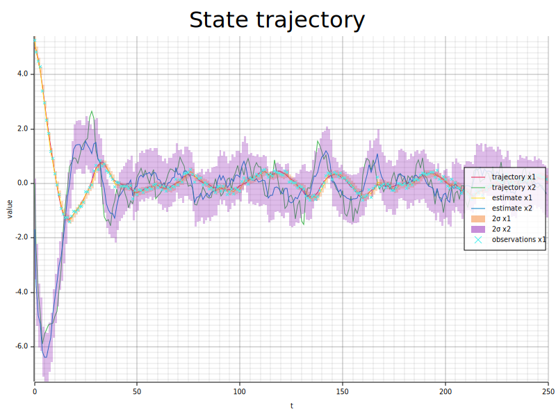
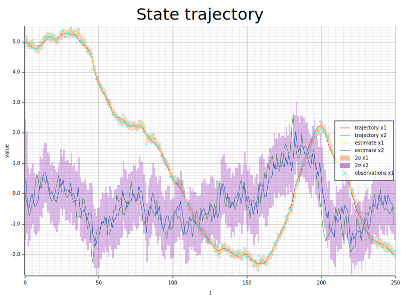

# smc-rs

A Rust library for simulating, filtering, and controlling linear stochastic dynamical systems. Built as a clean, type-safe implementation of classical state-space methods.

## Overview

`smc-rs` models linear, time-invariant, discrete-time systems with the following dynamics:
$$x_{t+1} = Ax_t + Bu_t + Hz_t, \quad y_t = Cx_t + w_t$$
where $x_t$ is the latent system state, $u_t$ is the control law, $z_t$ is the modelled "driving" noise, $y_t$ is the observation, and $w_t$ is the observation noise.

A discrete-time system can be created directly with the `DiscreteLinearSystem::new` method, or from a continuous-time system with a `DiscreteLinearSystem::from_*` method.
### Discretisation methods
Three methods are available when converting a continuous system to discrete time:

| Method | API | Notes |
|--------|-----|-------|
| Forward Euler | `from_euler` | First-order, fast, less accurate |
| Runge-Kutta 4 | `from_rk4` | Fourth-order, good general-purpose choice |
| Matrix exponential | `from_expm` | Exact for linear systems; recommended |

`from_expm` uses a Padé approximation with scaling and squaring (analogous to `scipy.linalg.expm`) to solve the noiseless system exactly via the a matrix exponential

$$\exp \Bigr(\begin{bmatrix}
 A & B \\
 0 & 0 \\
\end{bmatrix}dt\Bigr) = \begin{bmatrix}
    e^{Adt} & \int_0^{dt} e^{As}Bds \\ 0 & I
\end{bmatrix}$$
$$x_t = e^{Adt}x_0 + \int_0^{dt} e^{As}Bds \cdot u$$

The noise sources are discretised analytically.

### Simulating the system:
#### Controllers
A discrete-time system requires a controller that implements a control law. For now, the only controller is a null controller, $u=0$. `Controller::Null`
#### Filters
The system also requires a filter (or a smoother) that estimates the current state based on the observations. All estimates comprise a mean state and a covariance matrix.
#### Entry point
Once the system is defined
1. Call `.run()` to get an iterator that yields `(true_state, observation, estimate)` at each time step.
2. Plot the results with `StatePlot`.

## Examples

### Mass-Spring-Damper

A second-order mechanical system — position and velocity are the latent states, and the position is observed under Gaussian noise. A random force is applied to the mass. A Kalman filter recovers the trajectory from the observations.

```rust
use nalgebra::{SMatrix, matrix, vector};
use smc_rs::filters::{Filter, StateEstimate};
use smc_rs::maths::Noise;
use smc_rs::controllers::Controller;
use smc_rs::models::{ContinuousLinearSystem, DiscreteLinearSystem};
use smc_rs::plots::StatePlot;

fn mass_spring_damper(m: f64, k: f64, c: f64, sp: f64, so: f64) -> ContinuousLinearSystem<2, 1, 1, 1> {
    let a = matrix![0., 1.; -k/m, -c/m];
    let b = matrix![0.; 1./m];
    let h = matrix![0.; 1.];
    let c = matrix![1., 0.];
    ContinuousLinearSystem::new(a, b, h, c, Noise::Gaussian(0., sp), Noise::Gaussian(0., so))
}

fn main() -> Result<(), Box<dyn std::error::Error>> {
    let mut rng = rand::rng();
    let dt = 0.1;
    let (sp, so) = (1., 0.1);

    let system = mass_spring_damper(0.5, 2.16, 0.8, sp, so);
    let dsystem = DiscreteLinearSystem::from_expm(
        &system, dt,
        Controller::Null,
        Filter::Kalman { q: matrix![sp.powi(2)] * dt, r: matrix![so.powi(2)] },
    );

    let x0 = vector![5., 0.];
    let prior = StateEstimate::new(vector![0., 0.], SMatrix::from_diagonal_element(1.));
    let results: Vec<_> = dsystem.run(x0, prior, &mut rng).take(250).collect();

    StatePlot::new("kalman_output.svg").add_run(&results).draw()?;
    Ok(())
}
```

Run with:

```
cargo run --example msd
```



---

### Langevin Dynamics

An overdamped Langevin equation — a stochastic model of particle motion under a restoring force and thermal noise.

```
cargo run --example langevin
```



---

## Architecture

```
src/
├── models/       # ContinuousLinearSystem, DiscreteLinearSystem, RunIter
├── filters/      # Kalman filter, StateEstimate
├── controllers/  # Control laws
├── maths/        # Matrix exponential, noise sampling
├── plots/        # SVG output via plotters
└── types/        # Real = f64
```

### Generic dimensions

The library uses Rust const generics to track system dimensions at compile time:

| Parameter | Meaning |
|-----------|---------|
| `X` | State dimension |
| `U` | Input dimension |
| `Z` | Process noise dimension |
| `Y` | Observation dimension |

This means dimension mismatches are caught at compile time rather than at runtime.

### Kalman filter

The filter implements the standard predict–update cycle using the Joseph form for the covariance update:

**Predict:**
$$m_{k|k-1} = A m_{k-1} + B u_k, \quad P_{k|k-1} = A P_{k-1} A^\top + H Q H^\top$$

**Update:**
$$e = y_k - C m_{k|k-1}, \quad S = C P_{k|k-1} C^\top + R$$
$$K = P_{k|k-1} C^\top S^{-1}$$
$$m_k = m_{k|k-1} + K e, \quad P_k = (I - KC) P_{k|k-1} (I - KC)^\top + K R K^\top$$


## Dependencies

| Crate | Purpose |
|-------|---------|
| [`nalgebra`](https://nalgebra.org) | Statically-sized matrices and vectors |
| [`plotters`](https://plotters-rs.github.io) | SVG rendering |
| [`rand`](https://docs.rs/rand) | Random number generation |
| [`rand_distr`](https://docs.rs/rand_distr) | Gaussian sampling |

## Roadmap

I would like to implement the following features:

### Non-Gaussian noise
- **Variance-gamma process** — heavier tails than Gaussian, simple simulation
- **$\alpha$-stable laws** — very general applicability

### Nonlinear and non-Gaussian filters
- **Extended Kalman filter (EKF)** — autodiff for linearisation of system around current estimate
- **Particle filter** — general sequential monte-carlo schemes with various proposals 
- **Marginal particle filter** — Rao-Blackwellised variant that marginalises out the linear-Gaussian components for improved efficiency
- **Parameter estimation** - ML methods, EM methods, particle MCMC

### Smoothers
- **RTS smoother** — Rauch-Tung-Striebel backward pass to recover smoothed estimates using the full observation sequence

### Controllers
- **State feedback / LQR** — linear-quadratic regulator; optimal state feedback for linear systems with quadratic cost
- **Model predictive control (MPC)** — receding-horizon optimisation with constraints
