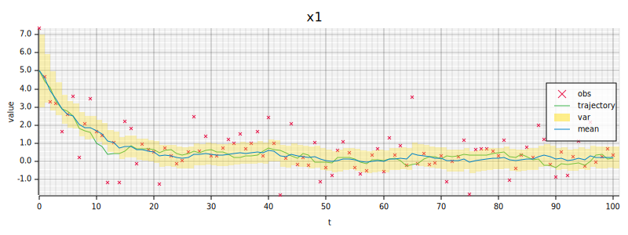

# ssm-rs

A Rust library for simulating, filtering, and controlling linear stochastic dynamical systems. Built as a clean, type-safe implementation of classical state-space methods.

## Overview

`ssm-rs` models linear, time-invariant, discrete-time systems with the following dynamics:
$$x_{t+1} = Ax_t + Bu_t + Hz_t, \quad y_t = Cx_t + w_t$$
where $x_t$ is the latent system state, $u_t$ is the control law, $z_t$ is the modelled "driving" noise, $y_t$ is the observation, and $w_t$ is the observation noise.

A discrete-time system can be created directly with `DiscreteLinearSystem::new`, or from a continuous-time system via `DiscreteLinearSystem::from_expm`.

### Discretisation

`DiscreteLinearSystem::from_expm` converts a continuous-time system to discrete time. It uses a Padé approximation with scaling and squaring (analogous to `scipy.linalg.expm`) to solve the noiseless system exactly via the matrix exponential:

$$\exp \Bigr(\begin{bmatrix}
 A & B \\
 0 & 0 \\
\end{bmatrix}dt\Bigr) = \begin{bmatrix}
    e^{Adt} & \int_0^{dt} e^{As}Bds \\ 0 & I
\end{bmatrix}$$
$$x_t = e^{Adt}x_0 + \int_0^{dt} e^{As}Bds \cdot u$$

The noise sources are discretised analytically.

### Trait-based design

The library is built around four core traits, which makes it straightforward to add new implementations:

- **`Dynamics<X, U, Y, Z>`** — defines how the state evolves (`f`, `propagate`) and what is observed (`observe`). Implemented by `ContinuousLinearSystem` and `DiscreteLinearSystem`.
- **`Filter<D, X, U, Y, Z>`** — defines a `predict`/`update` cycle over a `StateEstimate`. Implemented by `KalmanFilter`.
- **`Controller<X, U>`** — maps a state to a control input. Implemented by `Nontroller` (zero input).
- **`Noise<X>`** — samples a noise vector. Implemented by `WhiteNoise` and `Noiseless`.

The dynamics, filter, controller, and noise are constructed independently and composed at simulation time, giving full flexibility over what gets paired with what.

### Simulating the system

Simulation is a manual loop — call `dynamics.propagate`, then `filter.predict` and `filter.update` at each step:

```rust
for _ in 0..n {
    x = dynamics.propagate(&x, &u, &process_noise.sample(&mut rng));
    state = filter.predict(&state, &u);
    let y = dynamics.observe(&x, &observation_noise.sample(&mut rng));
    state = filter.update(&state, &y);
}
```

## Examples

### Linear Damper

A first-order system $\dot{s} = -\lambda s$ — a scalar state decaying exponentially, observed under Gaussian noise. A Kalman filter recovers the trajectory.

```rust
use nalgebra::{vector, matrix};
use ssm_rs::controllers::{Controller, Nontroller};
use ssm_rs::dynamics::{ContinuousLinearSystem, DiscreteLinearSystem, Dynamics};
use ssm_rs::noise::{WhiteNoise, Noise};
use ssm_rs::filters::{Filter, KalmanFilter, StateEstimate};
use ssm_rs::plots::StatePlot;

fn main() {
    let continuous_dynamics = ContinuousLinearSystem::new(
        matrix![-1.],
        matrix![0.],
        matrix![1.],
        matrix![1.],
    );
    let dt = 0.1;
    let dynamics = DiscreteLinearSystem::from_expm(&continuous_dynamics, dt);

    let controller = Nontroller;
    let sp = 0.5;
    let so = 1.;
    let process_noise = WhiteNoise::new(sp * dt.sqrt());
    let observation_noise = WhiteNoise::new(so);
    let mut rng = rand::rng();

    let mut x = vector![5.];
    let filter = KalmanFilter::new(dynamics, matrix![sp*sp*dt], matrix![so*so]);
    let mut state = StateEstimate::new(x, matrix![1.]);
    let u = controller.control_law(&x);

    let n = (10. / dt) as usize;
    for _ in 0..n {
        x = dynamics.propagate(&x, &u, &process_noise.sample(&mut rng));
        state = filter.predict(&state, &u);
        let y = dynamics.observe(&x, &observation_noise.sample(&mut rng));
        state = filter.update(&state, &y);
    }
}
```

Run with:

```
cargo run --example damper
```



---

## Architecture

```
src/
├── dynamics/     # Dynamics trait, ContinuousLinearSystem, DiscreteLinearSystem
├── filters/      # Filter trait, KalmanFilter, StateEstimate
├── controllers/  # Controller trait, Nontroller
├── noise/        # Noise trait, WhiteNoise, Noiseless
├── maths/        # Matrix exponential
├── plots/        # SVG output via plotters
└── types/        # Real = f64
```

### Generic dimensions

The library uses Rust const generics to track system dimensions at compile time:

| Parameter | Meaning |
|-----------|---------|
| `X` | State dimension |
| `U` | Input dimension |
| `Z` | Process noise dimension |
| `Y` | Observation dimension |

This means dimension mismatches are caught at compile time rather than at runtime.

### Kalman filter

The filter implements the standard predict–update cycle using the Joseph form for the covariance update:

**Predict:**
$$m_{k|k-1} = A m_{k-1} + B u_k, \quad P_{k|k-1} = A P_{k-1} A^\top + H Q H^\top$$

**Update:**
$$e = y_k - C m_{k|k-1}, \quad S = C P_{k|k-1} C^\top + R$$
$$K = P_{k|k-1} C^\top S^{-1}$$
$$m_k = m_{k|k-1} + K e, \quad P_k = (I - KC) P_{k|k-1} (I - KC)^\top + K R K^\top$$


## Dependencies

| Crate | Purpose |
|-------|---------|
| [`nalgebra`](https://nalgebra.org) | Statically-sized matrices and vectors |
| [`plotters`](https://plotters-rs.github.io) | SVG rendering |
| [`rand`](https://docs.rs/rand) | Random number generation |
| [`rand_distr`](https://docs.rs/rand_distr) | Gaussian sampling |

## Roadmap

I would like to implement the following features:

### Non-Gaussian noise
- **Variance-gamma process** — heavier tails than Gaussian, simple simulation
- **$\alpha$-stable laws** — very general applicability

### Nonlinear and non-Gaussian filters
- **Extended Kalman filter (EKF)** — autodiff for linearisation of system around current estimate
- **Particle filter** — general sequential monte-carlo schemes with various proposals 
- **Marginal particle filter** — Rao-Blackwellised variant that marginalises out the linear-Gaussian components for improved efficiency
- **Parameter estimation** - ML methods, EM methods, particle MCMC

### Smoothers
- **RTS smoother** — Rauch-Tung-Striebel backward pass to recover smoothed estimates using the full observation sequence

### Controllers
- **State feedback / LQR** — linear-quadratic regulator; optimal state feedback for linear systems with quadratic cost
- **Model predictive control (MPC)** — receding-horizon optimisation with constraints
